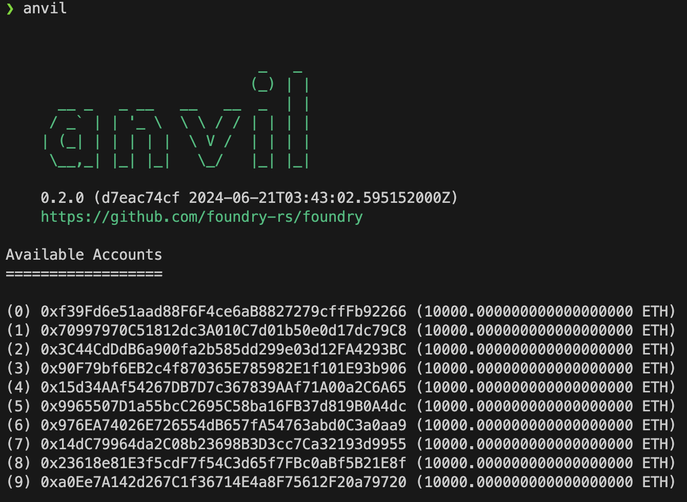
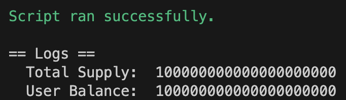
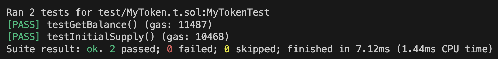

# 4. 테스트 및 배포

## Hardhat vs Foundry

스마트 계약을 개발하기 위한 프레임워크로 가장 널리 사용되는 Hardhat과 Foundry를 비교해보자.

|특징|Hardhat|Foundry|
|:---:|:---:|:---:|
|컨셉|유연성 및 모듈성 / 광범위한 플러그인 지원을 제공|높은 성능과 빠른 컴파일 속도|
|스크립트|JavaScript 및 TypeScript|Solidity|
|테스트|JavaScript 기반 테스트 프레임워크인 Mocha와 어서션 라이브러리 Chai를 사용한 자동화된 테스트 지원|forge 도구를 사용한 고성능 테스트 지원 / 치트 코드를 사용해 다양한 테스트 시나리오를 쉽게 설정|
|단점|높은 확장성이 비례해 초기 설정 및 환경 구성에 시간이 필요 / 버전별 내장 메서드명의 차이가 있기 때문에 협업시 버전 통일이 중요|비교적 신생 툴로 커뮤니티와 서드파티 통합이 아직 성장 중|
|적합|높은 레벨의 TypeScript와 풍부한 플러그인 생태계가 필요|Rust와 같은 저수준의 언어를 선호하고, 빠르고 혁신적인 테스트 기능이 필요 / 고급 스마트 계약 분석, 감사|

### Remix 와의 차이

Remix는 이더리움 스마트 계약을 작성, 배포, 테스트하는 데 사용되는 온라인 통합 개발 환경(IDE)으로 브라우저를 통해 접근 가능하며 설치가 불필요하고 직관적인 인터페이스로 교육을 목적으로 하는 입문자에게 적합하다.

다만, 통합 기능이 제한적이고 브라우저 세션이 만료되면 이전의 기록이 사라져 참고할 수 없기 때문에 복잡한 시나리오나 대규모 프로젝트에서는 적합하지 않다.

따라서 정리해보면 적절한 도구를 사용하는 기준은 다음과 같다.
- Remix: 초보자, 빠른 프로토타이핑, 교육 목적
- Hardhat: 대규모 및 복잡한 프로젝트를 작업하는 전문 개발자
- Foundry: 고성능, 고급 테스트 기능 및 효율성을 찾는 개발자

<br/>

## Foundry 오버뷰

참조: [Foundry Book](https://book.getfoundry.sh/)

Foundry는 스마트 계약 개발, 테스트, 배포, 디버깅까지 모든 과정을 지원하는 통합된 환경을 제공하며, 이를 통해 복잡한 설정 없이 바로 개발에 집중할 수 있다는 장점이 있다.

또한 빠른 컴파일 속도와 다양한 테스트 도구를 지원하기 때문에 스마트 계약 개발을 위한 강력하고 유용한 툴로 사용되고 있다.

### 1) 설치
**1-1) Foundryup 사용하기**

다음 명령을 실행하면 Foundryup이 설치되고, 화면의 지침을 따르면 foundryupCLI을 사용할 수 있다.
```bash
curl -L https://foundry.paradigm.xyz | bash
```
> ℹ️ 참고 <br/>
Windows를 사용하는 경우 현재 Foundryup이 Powershell 또는 Cmd를 지원하지 않으므로 Git BASH 또는 WSL을 터미널로 설치하고 사용해야 한다.

**1-2) 빌드**

**전제조건**
Rust 컴파일러와 cargo가 필요하다. 가장 쉬운 방법은 [```rustup.rs```](https://rustup.rs/)를 사용하는 것이다.

Foundry는 일반적으로 최신 안정 버전의 Rust에서만 빌드를 지원한다. 이전 버전의 Rust를 사용 중이라면 rustup을 사용하여 업데이트할 수 있다.
```bash
rustup update stable
```

> ℹ️ 참고 <br/>
Windows에서는 최신 버전의 Visual Studio도 필요하며, "Desktop Development With C++" 작업 부하 옵션을 설치해야 한다.

**빌딩**

```bash
# 방법 1) master 브랜치에에서 설치하거나 업데이트
foundryup --branch master

# 방법 2) 사용자 지정 경로에서 설치하거나 업데이트 (여러 프로젝트에서 각 다른 버전의 Foundry를 사용할 때 유용)
foundryup --path path/to/foundry

# 방법 3) 단일 명령어로 간단하고 빠름
cargo install --git https://github.com/foundry-rs/foundry --profile local --locked forge cast chisel anvil

# 방법 4) 저장소를 복사해와서 수동으로 빌드 (설치 과정을 세밀하게 조정 가능)
git clone https://github.com/foundry-rs/foundry.git
cd foundry
# install Forge
cargo install --path ./crates/forge --profile local --force --locked
# install Cast
cargo install --path ./crates/cast --profile local --force --locked
# install Anvil
cargo install --path ./crates/anvil --profile local --force --locked
# install Chisel
cargo install --path ./crates/chisel --profile local --force --locked
```

**1-3) Github Action에서 CI 설치**

Foundry 기반 프로젝트에서 CI/CD 파이프라인을 설정할 때 매우 유용한 도구로, 로컬 개발이나 간단한 프로젝트에서는 필요하지 않을 수 있지만, 자동화된 빌드와 테스트 환경을 구성하려는 경우 강력한 도움을 줄 수 있다.

[foundry-rs/foundry-toolchain](https://github.com/foundry-rs/foundry-toolchain?tab=readme-ov-file) GitHub Action을 참조

**1-4) Docker를 사용한 Foundry 사용**

Foundry는 Docker 컨테이너 내에서도 사용할 수 있다. Docker가 설치되어 있지 않다면 [Docker 웹사이트](https://docs.docker.com/get-docker/)에서 직접 설치한다.

설치가 끝나면 최신 릴리즈 버전을 받는다.

```bash
docker pull ghcr.io/foundry-rs/foundry:latest
```

Docker 이미지를 로컬로 빌드하는 것도 가능하다.

```bash
docker build -t foundry .
```
> ℹ️ 참고 <br/>
일부 머신(M1 칩이 있는 머신 포함)은 로컬에서 도커 이미지를 빌드하지 못할 수도 있다.


### 2) 프로젝트 기본 구조

**2-1) 프로젝트 생성, 컴파일, 테스트**

새 프로젝트를 생성한다.
```bash
$ forge init hello_foundry
```
프로젝트의 초기 구조는 다음과 같다.
```bash
$ cd hello_foundry
$ tree . -d -L 1
.
├── lib # 프로젝트에서 사용하는 라이브러리 파일 (다른 소스 파일에서 공유하는 코드나 기능을 포함)
├── script # 빌드 스크립트, 배포 스크립트 파일
├── src # 프로젝트의 핵심 코드와 모듈 파일
└── test # 유닛 테스트, 통합 테스트 등을 수행하는 코드 파일

4 directories
```

프로젝트를 빌드한다.
```bash
$ forge build
Compiling 27 files with Solc 0.8.19
Solc 0.8.19 finished in 1.27s
Compiler run successful!
```
테스트를 실행한다.
```bash
$ forge test
No files changed, compilation skipped

Ran 2 tests for test/Counter.t.sol:CounterTest
[PASS] testFuzz_SetNumber(uint256) (runs: 256, μ: 30999, ~: 31310)
[PASS] test_Increment() (gas: 31325)
Suite result: ok. 2 passed; 0 failed; 0 skipped; finished in 10.74ms (10.28ms CPU time)

Ran 1 test suite in 11.82ms (10.74ms CPU time): 2 tests passed, 0 failed, 0 skipped (2 total tests)
```

---

**2-2) 종속성**

기존 Hardhat과 같은 경우 npm package를 import 하는데, Foundry는 git submodules를 기본으로 지원하기 때문에 스마트 컨트랙트 코드를 포함한 모든 Github repo를 사용할 수 있다.

필요한 라이브러리를 추가한다.
```bash
# 추가
# transmissions11/solmate 저장소의 solmate 라이브러리를 추가
$ forge install transmissions11/solmate
```

프로젝트 내에서 사용되는 외부 패키지의 파일 경로를 사용자가 원하는 형태로 매핑할 수 있다. 가독성이 향상되고 유지보수와 버전 관리에 용이하다.
```bash
# 프로젝트 루트 경로에 있는 foundry.toml에 재매핑 정의
remappings = [
  "@solmate-utils/=lib/solmate/src/utils/"
]
```
```bash
# 재매핑
$ forge remappings
````
```bash
# Solidity에서 다음과 같이 임포트하여 사용
import "@solmate-utils/LibString.sol";
```

라이브러리를 업데이트한다.
```bash
# 업데이트
$ forge update lib/solmate
```

라이브러리를 제거한다.
```bash
# 제거
$ forge remove solmate
```

### 3) 스마트 계약 작성

`src` 디렉토리에 스마트 계약 파일(.sol)을 작성한다.

```solidity
// contracts/MyContract.sol
pragma solidity ^0.8.0;

contract MyContract {
    string public message;

    constructor(string memory initialMessage) {
        message = initialMessage;
    }

    function updateMessage(string memory newMessage) public {
        message = newMessage;
    }
}
```

필요한 종속성을 추가하고 위치에 맞게 재매핑한다.

```bash
# 종속성 설치
$ forge install transmissions11/solmate

# foundry.toml 에 재매핑 경로 추가
remappings = [
  "@solmate-tokens/=lib/solmate/src/tokens/"
]

# 재매핑
$ forge remappings
```

컴파일한다.

```bash
$ forge compile
```

### 4) 배포

**4-1) 배포 스크립트 작성**

`script` 디렉토리에 배포 스크립트 파일(.s.sol)을 작성한다.

```solidity
// script/MyContract.s.sol

// SPDX-License-Identifier: UNLICENSED
pragma solidity ^0.8.13;

import "forge-std/Script.sol";
import "../src/MyToken.sol";

contract MyTokenScript is Script {
    function run() public {
        vm.startBroadcast();

        // 토큰 이름, 심볼, 소수점 자릿수, 초기 공급량 설정
        string memory name = "MyToken";
        string memory symbol = "MTK";
        uint8 decimals = 18;
        uint256 initialSupply = 100 * 10 ** decimals; // 100개

        // MyToken 컨트랙트 배포
        new MyToken(name, symbol, decimals, initialSupply);

        vm.stopBroadcast();
    }
}
```

**4-2) 로컬 체인에서 배포**

Foundry 로컬 체인 Anvil은 Go로 작성된 Ethereum 호환 개발 환경으로, 로컬 테스트를 위한 빠르고 효율적인 솔루션을 제공한다.

**[주요 기능]**

- 빠른 블록 생성
- 여러 개의 초기 계정 설정
- 실제 네트워크를 포크하여 로컬 환경에서 실제 데이터를 기반으로 테스트
- 사용자 정의 계정, 초기 상태, 가스 비용 등의 옵션 설정

Anvil을 실행한다.

```bash
# 로컬 이더리움 노드를 실행
anvil
```



배포 스크립트를 실행한다.

```bash
$ forge script script/MyToken.s.sol --rpc-url http://127.0.0.1:8545 --broadcast --private-key <MY_PRIVATE_KEY>
```


컨트랙트 배포가 성공하면 추가적인 스크립트를 작성해 컨트랙트 내 함수를 실행해볼 수 있다.

```solidity
// script/GetBalance.s.sol

// SPDX-License-Identifier: MIT
pragma solidity ^0.8.0;

import "forge-std/Script.sol";
import "../src/MyToken.sol";

contract GetBalanceScript is Script {
    function run() public {
        // 배포된 컨트랙트 주소
        address tokenAddress = <배포 된 컨트랙트 주소>;

        // MyToken 컨트랙트 인스턴스 생성
        MyToken token = MyToken(tokenAddress);

        // 총 발행량 확인
        uint256 totalSupply = token.totalSupply();
        console.log("Total Supply: ", totalSupply);

        // 특정 주소의 잔액 확인
        address userAddress = <확인 할 지갑 주소>;
        uint256 balance = token.getBalance(userAddress);
        console.log("User Balance: ", balance);
    }
}
```

```bash
$ forge script script/GetBalance.s.sol --rpc-url http://127.0.0.1:8545 --broadcast --private-key <MY_PRIVATE_KEY>
```



<br />

만약 복잡한 스크립트 필요 없이 단일 컨트랙트만 배포 한다면 `forge create` 명령어를 사용할 수 있다.

```bash
$ forge create --rpc-url http://127.0.0.1:8545 --private-key <MY_PRIVATE_KEY> src/MyToken.sol:MyToken --constructor-args "MyToken" "MTK" 18 1000000
```

<br />


**4-3) 지정 네트워크에서 배포**

.env 파일을 프로젝트 루트에 생성하고 다음 내용을 추가한다.

```text
INFURA_PROJECT_ID=your_infura_project_id
PRIVATE_KEY=your_private_key
```

[Infura Endpoints](https://docs.infura.io/api/network-endpoints) 에서 배포하고자 하는 네트워크의 엔드포인트, [Infura App](https://app.infura.io/) 에서 API key를 받아온다.

아래의 명령어를 실행하면 해당 네트워크에 원하는 계정으로 컨트랙트를 배포할 수 있다.

```bash
$ forge script script/MyToken.s.sol --rpc-url https://mainnet.infura.io/v3/$INFURA_PROJECT_ID --broadcast --private-key $PRIVATE_KEY
```

### 5) 테스트 스크립트 작성

`test` 디렉토리에 `MyToken.t.sol`을 작성한다.

```solidity
// SPDX-License-Identifier: UNLICENSED
pragma solidity ^0.8.13;

import "forge-std/Test.sol";
import "../src/MyToken.sol";

contract MyTokenTest is Test {
    MyToken public myToken;

    function setUp() public {
        string memory name = "MyToken";
        string memory symbol = "MTK";
        uint8 decimals = 18;
        uint256 initialSupply = 100 * 10 ** decimals;

        myToken = new MyToken(name, symbol, decimals, initialSupply);
    }

    function testInitialSupply() public {
        uint256 expectedSupply = 100 * 10 ** 18;
        assertEq(myToken.totalSupply(), expectedSupply);
    }

    function testGetBalance() public {
        address testAddress = address(this);
        uint256 balance = myToken.getBalance(testAddress);
        uint256 expectedBalance = 100 * 10 ** 18;
        assertEq(balance, expectedBalance);
    }
}
```

테스트를 실행한다.

```bash
$ forge test
```



### 6) 유용한 점

- 온체인에서 검증된 계약을 Forge 프로젝트로 복제할 수 있다.
    ```bash
    $ forge clone 0xC02aaA39b223FE8D0A0e5C4F27eAD9083C756Cc2 WETH9
    ```
- git submodules을 통해 다른 프로젝트에서 개발된 스마트 계약 역시 종속성을 통해 손쉽게 가져와 사용할 수 있다. 

- Hardhat과 호환성
    Forge는 npm 패키지와 같은 다른 종속성 관리 시스템과의 호환성을 위해 Hardhat 호환성 모드를 제공한다. 이 모드를 활성화하려면 --hh 플래그를 사용한다.