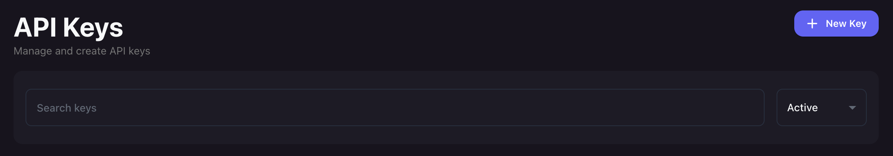
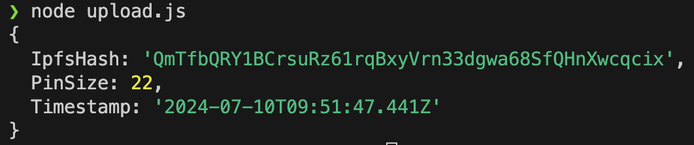
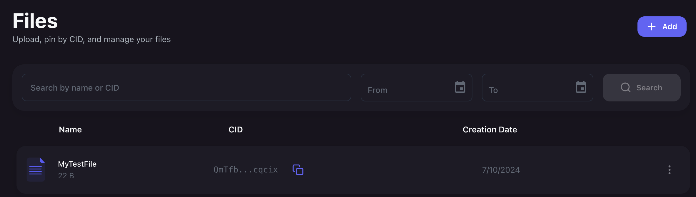

# 5. 분산 스토리지

## 분산 스토리지란?

분산 스토리지는 데이터를 여러 개의 독립적인 노드(컴퓨터)에 나누어 저장하는 방식이다. 중앙 집중식 서버 대신 네트워크에 참여하는 여러 컴퓨터에 데이터를 분산시킨다.

데이터의 안전성과 가용성을 높이고, 단일 장애 지점을 제거하여 시스템의 내구성을 강화하는 것이 목적이다.

이더리움 애플리케이션에서 모든 데이터를 블록체인에 저장하는 것은 비용적으로 부담이 크다. 사용자가 블록체인에 새 데이터를 추가할 때마다 비용을 지불해야하기 때문이다. 그래서 사용하는 것이 IPFS나 Swarm 같은 오프체인 저장소이다.

### 1) 중앙 집중식 스토리지와의 차이점

**중앙 집중식 스토리지**

데이터가 하나의 중앙 서버에 저장된다. 서버가 다운되면 데이터 접근이 불가능해진다.

**분산 스토리지**

데이터가 여러 노드에 분산되어 저장되므로, 일부 노드가 다운되더라도 다른 노드에서 데이터에 접근할 수 있다.

### 2) 분산 스토리지의 주요 이점

- 안정성: 데이터를 여러 노드에 복제하여 저장하므로, 일부 노드가 장애를 겪더라도 데이터 손실을 막을 수 있다.

- 확장성: 네트워크에 더 많은 노드를 추가함으로써 쉽게 스토리지 용량을 확장할 수 있다.

- 보안성: 데이터가 분산되어 있어 중앙 서버를 공격하는 것보다 훨씬 어려운 보안 환경을 제공한다.


## IPFS (InterPlanetary File System)

분산 스토리지 중 하나인 IPFS는 데이터가 해시값으로 주소화되고 여러 노드에 분산 저장되는 방식을 사용한다. 사용자가 데이터를 요청할 때, 가장 가까운 노드에서 데이터를 가져온다.

1.	파일 추가: 파일을 IPFS에 추가하면, IPFS는 파일을 청크(chunk)로 분할하고 각 청크에 대해 고유한 해시를 생성한다. 이 해시값이 파일의 주소로 사용됩니다. (이 해시값은 파일의 내용에 기반하여 생성되므로, 파일의 내용이 변경되면 해시값도 변경된다.)

2.	파일 검색: 파일을 검색할 때, 해당 파일의 해시값을 사용하여 네트워크에서 파일을 검색한다. 네트워크에 참여하는 노드들은 요청된 해시값과 일치하는 파일 청크를 반환한다.

3.	파일 연결: 분할된 파일 청크들은 연결되어 원래 파일로 복원된다. 이를 통해 사용자는 파일을 다운로드하고 사용할 수 있다.


## Pinata 로 IPFS 관리하기

**1) Pinata 계정 생성**

[Pinata](https://www.pinata.cloud/ipfs) 웹사이트에서 계정을 생성하고, `New Key` 버튼을 클릭해 새로운 API Key를 생성한다.



생성된 API Key, API Secret, JWT를 복사해 보관한다.

<br />

**2) Pinata CLI 설치**

```bash
npm install -g @pinata/sdk
```

**3) Node.js 프로젝트 설정**

```bash
mkdir pinata-example
cd pinata-example
npm init -y
npm install @pinata/sdk
touch upload.js
```

**4) 파일 업로드 코드 작성**

```javascript
// upload.js

const pinataSDK = require('@pinata/sdk');
const fs = require('fs');

// 위에서 복사해둔 key 기입
const pinata = new pinataSDK(
    'API Key',
    'API Secret',
    'JWT'
);

// 업로드하고자 하는 파일의 경로
const readableStreamForFile = fs.createReadStream('./test.txt');

const options = {
    pinataMetadata: {
        name: 'MyTestFile',
        keyvalues: {
            customKey: 'customValue'
        }
    },
    pinataOptions: {
        cidVersion: 0
    }
};

pinata.pinFileToIPFS(readableStreamForFile, options).then((result) => {
    console.log(result);
}).catch((err) => {
    console.error(err);
});
```

파일을 작성하고 실행한다.

```bash
node upload.js
```

업로드가 성공하면 다음과 같이 파일에 대한 IpfsHash 값을 얻을 수 있다.


