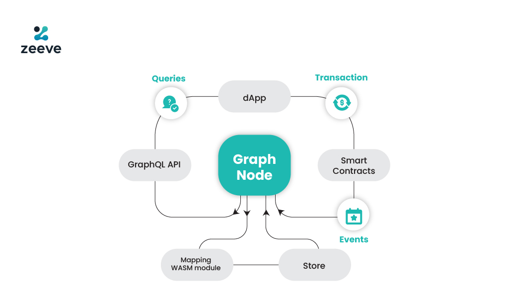

# 6. 데이터 쿼리

## 데이터 쿼리와 인덱싱

블록체인은 모든 거래와 데이터를 체인 형태로 연결하여 저장하기 때문에, 특정 데이터를 빠르게 검색하고 접근하는 것이 매우 어렵다.

Web2에서 사용되는 대부분의 DB들은 다양한 인덱스 구조를 지원하여, 필요한 데이터를 쉽게 불러와 사용자에게 제시할 수 있도록 하는 반면,

블록체인 데이터베이스는 머클 트리 구조를 사용하고, 디앱이 필요로 하는 정보에 대한 효율적인 인덱싱을 제공하지 않기 때문에, 개발자들은 블록체인 데이터를 추가로 가공해야 하는 번거로움에 직면한다.

특히 실시간 데이터를 필요로 하는 디앱에서 문제가 두드러지는데, Uniswap V3의 유동성(Liquidity)을 예로 들어보자.

> **Uniswap V3 유동성**
  
유동성을 공급하고 싶은 사용자가 고려해야 할 중요한 부분 중 하나는 공급할 풀의 유동성 크기이다. 풀의 유동성이 커야 스왑이 많이 일어나고, 수수료 수익을 크게 얻을 수 있기 때문이다.
  
이에 따라 Uniswap은 현재 각 풀의 유동성을 홈페이지 내에 제공하고 있는데, 블록체인 데이터베이스 내에서는 이 정보에 대한 직접적인 인덱싱을 제공하고 있지 않다.
  
Uniswap V3 상의 유동성 풀은 가격에 따라 잘게 쪼개진 구간 별로 존재하는 유동성 정보를 모두 더해야 전체 유동성을 구할 수 있다.
  
만약 이를 **별도의 데이터베이스에 기록**하거나, **중앙화된 써드 파티 솔루션**을 사용한다면 **높은 비용**과 **중앙화로 인한 단일 실패 지점 문제**를 피할 수 없다.

이 때, 데이터 쿼리와 인덱싱을 통해 문제를 해결할 수 있다.

1.	효율적인 데이터 검색

    블록체인 데이터는 크기가 크고 분산되어 있어, 필요한 데이터를 빠르게 검색하는 것이 어려우나, 인덱싱을 통해 특정 데이터를 신속하게 찾을 수 있다.

2.	실시간 데이터 접근

    많은 디앱은 실시간 데이터 접근이 필요하다. 예를 들어, 탈중앙화 금융(DeFi) 애플리케이션은 실시간으로 가격 정보를 제공해야 하는데, 인덱싱은 이러한 실시간 데이터 접근을 가능하게 한다.

3.	확장성
    
    디앱이 성장하고 사용자 수가 증가함에 따라 데이터 처리 요구도 증가하게 된다. 이 때, 인덱싱은 확장성을 제공하여 대규모 데이터를 효율적으로 처리할 수 있게 해준다.

---

## 데이터 인덱싱 도구

### 1) The Graph

The Graph는 블록체인 네트워크에서 발생하는 모든 데이터를 수집하고 인덱싱하여 디앱 개발자들이 직접 데이터를 관리하지 않고도 쉽고 빠르게 데이터를 쿼리할 수 있도록 한다.

The Graph에서는 모든 블록체인 데이터에 대해 표준화된 데이터 쿼리 방식을 제공하고, 다양한 블록체인과 스마트 계약 데이터를 쉽게 쿼리하고 사용할 수 있도록 한다.

The Graph는 어떤 데이터를 어떻게 인덱싱해야 하는지 정의하는 Subgraph와, 블록체인 데이터를 요구하는 대로 처리해 저장해주는 인덱서(indexer)를 통한 블록체인 오픈 데이터 마켓을 형성한다.

The Graph는 Graph Node라는 소프트웨어를 사용하여 블록체인 데이터를 수집한다. 이 노드는 스마트 계약의 이벤트와 블록 데이터를 모니터링하고, 이를 인덱싱한다. 개발자들은 GraphQL을 사용하여 이러한 인덱싱된 데이터를 쿼리할 수 있다.

**Subgraph**

서브그래프는 The Graph에서 특정 데이터 세트를 정의하고, 이를 인덱싱하는 단위이다. 디앱 개발자들은 서브그래프를 통해 자신들이 필요한 데이터를 지정하고 인덱싱할 수 있다.

서브그래프는 특정 디앱의 데이터 요구 사항에 맞게 설정된 데이터 인덱싱 구성으로, 이를 통해 개발자는 자신이 원하는 데이터만 효율적으로 인덱싱할 수 있다.

Graph Node에 의해 관리되며, 다음과 같은 구성 요소로 이루어져 있다.

- Manifest: 서브그래프의 정의와 메타데이터를 포함
- Schema: 데이터를 구조화하는 GraphQL 스키마를 정의
- Mapping: 이벤트 핸들러를 통해 데이터를 변환하고 저장하는 방법을 지정

**GraphQL**

GraphQL은 The Graph와 서브그래프를 통해 인덱싱된 데이터를 효율적으로 쿼리할 수 있는 언어이다.

GraphQL은 사용자가 필요한 데이터만 쿼리할 수 있게 하여, 불필요한 데이터 전송을 줄이고 응답 속도를 높인다. 이는 REST API와 달리, 단일 요청으로 필요한 모든 데이터를 가져올 수 있게 한다.

디앱 개발자는 GraphQL 쿼리를 작성하여 서브그래프에서 인덱싱된 데이터를 가져올 수 있다. 예를 들어, 특정 사용자의 거래 내역을 쿼리하거나, 특정 이벤트를 모니터링할 수 있다.

### 2) SubQuery

SubQuery는 주로 Polkadot 및 Substrate 생태계를 위해 설계된 데이터 인덱싱 솔루션으로, 블록체인 데이터를 수집, 인덱싱 및 쿼리하는 데 중점을 두는 도구이다.

Polkadot 생태계에서 고성능의 데이터 인덱싱 및 쿼리 솔루션을 제공하고, Polkadot 및 Substrate 기반 프로젝트의 데이터를 쉽게 접근하고 사용할 수 있게 한다.

SubQuery 프로젝트는 manifest 파일과 schema 파일을 사용하여 데이터를 모델링한다.

SubQuery 프로젝트를 생성하고, manifest 파일을 통해 데이터를 인덱싱할 소스와 방식을 정의한 후, GraphQL 또는 REST API를 통해 데이터를 쿼리할 수 있다.

---

## The Graph와 SubQuery의 커뮤니티와 생태계

- The Graph

    - Ethereum 커뮤니티를 포함한 다양한 블록체인 커뮤니티에서 널리 사용되며, 다양한 디앱들이 The Graph를 사용하여 데이터를 인덱싱하고 쿼리한다.

	- GRT 토큰: The Graph 생태계 내에서 사용되는 네이티브 토큰으로, 인덱서 및 큐레이터 보상 등에 사용된다.

- SubQuery

	- Polkadot 및 Substrate 생태계에 집중되어 있으며, Polkadot 프로젝트를 지원하는 다양한 툴과 통합된다.

	- SQT 토큰: SubQuery의 네이티브 토큰으로, 네트워크 참여와 보상에 사용된다.

---

참고 문헌:
[더 그래프 (The Graph) — 블록체인 데이터 인프라의 진화
더 그래프 네트워크의 운영 메커니즘과 최근 동향을 중심으로](https://medium.com/despread-creative/%EB%8D%94-%EA%B7%B8%EB%9E%98%ED%94%84-the-graph-%EB%B8%94%EB%A1%9D%EC%B2%B4%EC%9D%B8-%EB%8D%B0%EC%9D%B4%ED%84%B0-%EC%9D%B8%ED%94%84%EB%9D%BC%EC%9D%98-%EC%A7%84%ED%99%94-575ee863c571) 