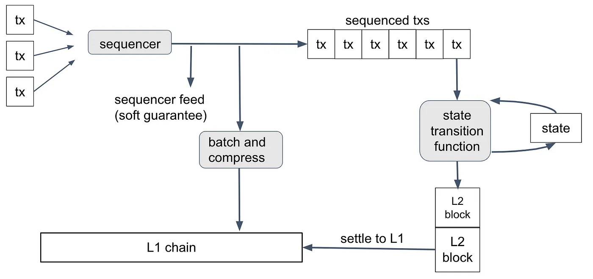

# 아비트럼 개발자 교육 모듈

  ## 아비트럼 네트워크 탄생 배경 및 현황 개요

블록체인과 웹3 기술의 급속한 발전으로 확장성 문제가 업계의 핵심 과제로
대두되었다. 이러한 맥락에서 2020년, 이더리움 생태계는 중대한 전환점을
맞이했다. 비탈릭 부테린을 포함한 이더리움 핵심 개발자들이 \'롤업 중심의
로드맵\'이라는 새로운 비전을 제시했고, 이는 블록체인 업계에 상당한
파장을 일으켰다.

롤업 기술은 메인 체인의 보안성을 유지하면서도 처리 속도와 확장성을
획기적으로 개선할 수 있는 혁신적 해결책으로 주목받았다. 이더리움 재단이
이 방향성을 공식화하면서 아비트럼, 옵티미즘 등 주요 롤업 프로젝트들도
급속히 성장하기 시작했다.

특히 아비트럼은 이더리움의 비전에 발맞춰 선도적으로 롤업 기술을 개발하고
상용화했다. 아비트럼은 이더리움의 확장성 문제를 해결하기 위해 오프체인
랩스(Offchain Labs)에서 개발한 레이어 2 솔루션이다. 2018년 설립된
오프체인 랩스는 프린스턴 대학의 컴퓨터 과학자들이 주도하여, 학계의 최신
연구 성과를 블록체인 기술에 접목시키고자 했다. 아비트럼의 핵심 기술인
옵티미스틱 롤업은 이더리움의 보안성을 유지하면서도 처리 속도와 비용
효율성을 크게 개선할 수 있는 혁신적인 접근 방식이다.이더리움의 롤업 중심
전략과 아비트럼의 기술력이 시너지를 발휘하면서, 웹3 생태계는 새로운
도약의 기회를 맞이하게 되었다.

이러한 변화는 단순한 기술 혁신을 넘어 블록체인의 대중화를 앞당기는
중요한 전환점이 되었다. 롤업 기술의 도입으로 거래 속도는 향상되고
수수료는 감소했으며, 이는 더 많은 사용자와 개발자들을 블록체인 생태계로
유인하는 계기가 되었다. 2020년부터 시작된 이 \'롤업 혁명\'은 오늘날
웹3의 폭발적인 성장을 이끈 주요 동력 중 하나로 평가받고 있다.

Inside Arbitrum Nitro detail in this [link ](https://docs.arbitrum.io/how-arbitrum-works/inside-arbitrum-nitro)

*이더리움 메인넷 내 발생하는 가스비와 레이어 2의 가스비 비교(Source :
l2fees.info)*

아비트럼은 옵티미스틱 롤업 기술을 채택하여, 트랜잭션 처리를 레이어 2에서
수행하고 그 결과만을 주기적으로 이더리움 메인넷에 기록한다. 이 과정에서
트랜잭션의 유효성을 \'낙관적\'으로 가정하고, 문제가 있을 경우 이의제기할
수 있는 기간을 두는 방식을 채택했다. 이를 통해 아비트럼은 이더리움의
보안성을 상속받으면서도, 훨씬 낮은 비용과 높은 처리 속도를 실현할 수
있게 되었다.

**아비트럼의 주요 특징:** 아비트럼은 다음과 같은 특징을 통해 개발자와
사용자들에게 매력적인 플랫폼을 제공한다.

  ## 특징
  **이더리움 호환성** : 기존 이더리움 스마트 컨트랙트와 개발 도구를 그대로
                   사용할 수 있어, 개발자들의 진입 장벽을 낮췄다.

  **높은 확장성** : 이더리움 대비 최대 100배 이상의 처리량을 제공한다.

  **낮은 거래 비용** : 가스비를 이더리움 대비 10\~20배 가량 절감할 수 있다.

  **강력한 보안성** : 이더리움의 보안 모델을 그대로 활용하여 높은 수준의
                   안전성을 보장한다.

아비트럼의 성장과 생태계: 아비트럼은 출시 이후 급속한 성장을 보이며,
레이어 2 솔루션 중 가장 큰 생태계를 구축했다. 2024년 현재 전체 롤업
TVL의 42% 이상을 차지하고 있으며, 560개 이상의 DApp이 온보딩되어 있다.
아베(Aave), 유니스왑(Uniswap) 등 대형 DeFi 프로젝트부터 최신 트렌드의
애플리케이션까지 다양한 서비스가 아비트럼 위에서 운영되고 있다.

Why Use Arbitrum? detail in this [link ](https://docs.arbitrum.io/how-arbitrum-works/inside-arbitrum-nitro)

## 롤업과 트랜잭션 라이프 사이클

1)  **Roll Up**

아비트럼의 롤업 프로토콜은 레이어 2 솔루션의 핵심 기술로, 이더리움의
확장성 문제를 해결하는 데 중요한 역할을 한다. 일반 사용자나 개발자가 이
프로토콜의 내부 작동 원리를 자세히 알 필요는 없지만, 기본적인 이해는
아비트럼 생태계에서 개발을 시작하는 데 도움이 될 수 있다.

아비트럼은 '옵티미스틱 롤업\'이라는 레이어 2 확장 솔루션을 채택했다. 이
방식의 핵심은 모든 트랜잭션을 일단 유효하다고 가정하고 처리한 뒤, 나중에
문제가 있다면 이의를 제기할 수 있도록 하는 것이다. 구체적으로,
아비트럼은 모든 트랜잭션 데이터를 이더리움 메인넷에 \'Call data(콜데이터)\'로
기록한다. 이렇게 하면 누구나 체인의 현재 상태를 확인하고 검증할 수
있는데, 새로운 블록이 제안되면 약 일주일 동안의 이의 제기 기간을 두며 이
기간 동안 누구든 해당 블록의 유효성에 의문을 제기할 수 있다.

Search "Optimistic Rollup" for detail in this [link ](https://docs.arbitrum.io/how-arbitrum-works/inside-arbitrum-nitro)

만약 문제가 제기되면, 아비트럼은 \'Interactive fraund proofs(대화형 사기 증명)\'이라는 독특한
방식으로 이를 해결한다. 이 방식은 양측이 단계적으로 문제를 좁혀가다가
최종적으로 단 하나의 실행 단계에 대해서만 이더리움 메인넷에서 검증하는
방식이다. 이 접근법의 장점은 여러 가지다. 우선, 정상적인 상황에서는
메인넷에 최소한의 데이터만 기록하면 되므로 가스 비용을 크게 줄일 수
있다. 또한, 이 방식은 더 복잡한 트랜잭션도 처리할 수 있어 이더리움의
가스 한도를 넘어서는 작업도 가능하게 만든다. 게다가 메인넷의 부담을
최소화하면서도 높은 처리량을 달성할 수 있어 확장성 측면에서도 큰 이점이
있다. 결과적으로 이러한 옵티미스틱 롤업 방식은 아비트럼이 효율적이고
안전한 레이어 2 솔루션으로 자리잡는 데 핵심적인 역할을 했다. 이 방식은
대부분의 경우 트랜잭션이 올바르다고 낙관적으로 가정하면서도, 필요할 때
강력한 검증 메커니즘을 제공하는 균형 잡힌 해결책이라고 볼 수 있다.

롤업 프로토콜의 주요 목적은 트랜잭션 결과를 확인하는 것이다. 트랜잭션의
실제 결과는 체인의 인박스에 있는 메시지 시퀀스에 의해 결정되며, 롤업
프로토콜은 이 결과를 이더리움 메인넷에 안전하게 기록하는 역할을 한다.
이는 두 가지 중요한 이유로 필요하다. 첫째, 누군가가 결과에 대해 거짓말을
할 수 있으므로 신뢰 없는 방식으로 진실을 확인해야 한다. 둘째, 이더리움은
모든 아비트럼 트랜잭션을 직접 모니터링할 수 없기 때문에, 확인된 결과에
의존하여 L1으로의 출금 등의 작업을 처리할 수 있어야 한다.

롤업 프로토콜의 핵심 참여자는 밸리데이터(validator)다. 밸리데이터 중 일부는
스테이커(staker)가 되어 ETH를 예치하고, 정직하게 행동하면 이를 회수할 수
있다. 일반적으로 하나의 밸리데이터만 스테이킹하며, 다른 당사자들의 행동이
필요 없는 한 이 상태가 유지된다. 아비트럼 원에서는 현재
밸리데이터/스테이커가 허용 목록으로 관리되고 있지만, 원칙적으로는 누구나 이
역할을 수행할 수 있다.

롤업 체인은 \'RBlock\'이라 불리는 롤업 블록의 연속으로 구성된다. 이는 L1
이더리움 블록이나 L2 니트로 블록과는 다른, 별도의 체인을 형성한다. 각
RBlock은 블록 번호, 이전 블록 번호, 생성된 L2 블록 수, 처리된 인박스
메시지 수, 그리고 체인 역사상 생성된 출력의 해시를 포함한다.

롤업 체인의 이해를 돕기 위한 예시는 아래와 같다.

보통 롤업 체인은 두 부분으로 나뉜다. 왼쪽에는 이미 확인된 RBlock(블록
번호 91\~94)들이 있는데, 이는 레이어 1 컨트랙트가 인정하고 기록한 체인의
역사다. 이 중 가장 최근에 확인된 RBlock 94을 \"최신 확인 RBlock\"이라고
한다. 오른쪽에는 새로 제안된 RBlock(95\~98)들이 있다. 이들은 아직
확인되지 않았지만, 시간이 지나면 대부분 확인될 것이다.

주목할 만한 점은 새로 제안된 RBlock이 이전에 제안된 RBlock 위에 쌓일 수
있다는 것이다. 이 덕분에 밸리데이터들은 이전 블록의 확인을 기다리지 않고도
계속해서 새 블록을 제안할 수 있어, 체인의 효율성을 크게 높인다.

하지만 악의적인 밸리데이터들이 있으면 체인 상태가 복잡해질 수 있다. 예를
들어, 위 이미지처럼 RBlock 101이 적합한 블록이라고 판단되지 않는다면
블록 제안이 거부된다. 이후 RBlock 102가 올바른 후속블록으로 확인된다.
RBlock 103이 확인되어 최신 확인 RBlock이 되었을 때, 위 이미지처럼
여러개의 블록이 서로가 올바른 후속블록이라 주장하는 경우(RBlock 106,
RBlock 109) 또한 존재한다. 이런 복잡한 상황을 다루기 위해 프로토콜은
세밀한 규칙을 가지고 있다. RBlock들은 번호 순서대로 처리되며, 어떤
블록의 운명은 그 이전 블록의 상태에 따라 결정된다. 이를 통해 프로토콜은
일관성 있고 안정적인 체인 상태를 유지할 수 있다.

실제로 이런 복잡한 상황은 거의 일어나지 않는다. 대부분의 경우 밸리데이터들은
정직하게 행동하고, 체인은 순조롭게 진행된다. 그래도 프로토콜은 최악의
상황에 대비해 설계되어 있어, 어떤한 경우라도 체인의 무결성을 지킬 수 있다.

이러한 롤업 프로토콜 설계 덕분에 아비트럼은 높은 확장성과 보안성을
동시에 달성할 수 있다. 개발자들은 이런 탄탄한 기술 기반 위에서 안심하고
자신의 애플리케이션을 만들 수 있다. 실제 개발 과정에서 이런 내부 구조를
직접 다룰 일은 없겠지만, 기본 원리를 이해하면 아비트럼 생태계에서 더
효과적으로 활동하는 데 도움이 될 것이다.

Search "Rollup Chain" for details in this [link ](https://docs.arbitrum.io/how-arbitrum-works/inside-arbitrum-nitro)

2)  **Transaction LifeCycle**

아비트럼 트랜잭션의 라이프 스케일은 복잡해 보이지만, 단계별로 살펴보면
그 원리를 쉽게 이해할 수 있다. 이 과정을 통해 아비트럼이 어떻게
이더리움의 확장성 문제를 해결하면서도 보안성을 유지하는지 알 수 있다.

트랜잭션은 시퀀서에서 시작된다. 시퀀서는 트랜잭션의 순서를 결정하는
중요한 역할을 하며, 클라이언트가 트랜잭션을 보내면 시퀀서는 이를 두 가지
방법으로 받을 수 있다:

  **직접 전송(오프 체인)** : L2 환경에서 일반적으로 사용되는 방식. 클라이언트가 체인갑을 L2 노드에 연결하고 서명된 트랜잭션을 직접 전송한다.

  **L1을 통한 delayed 전송(Delay Inbox를 통한 전송)** : 클라이언트가 L1 트랜잭션을 아비트럼 체인의 delayed inbox에 서명하여 시퀀서에 메시지를 보내는 방식. 주로 ETH나 토큰을 브릿지를 통해 예치할 때 사용된다.

만약 오프 체인으로 전송받는 방법을 택한다면, 시퀀서가 트랜잭션을 받았을
때 다음과 같은 과정을 거친다:

1.  오프체인 인박스에서 트랜잭션 순서를 정한다.

2.  아비트럼 니트로 VM을 사용해 로컬에서 실행한다 (이 과정에서 L1과 L2
    수수료를 계산하고 할당한다).

3.  클라이언트에게 거의 즉시 트랜잭션 영수증(Transaction receipt)을
    제공한다 (보통 1초 미만, 평균 260ms 정도 소요).

이 단계에서 클라이언트는 시퀀서를 신뢰해야 한다. 이를 \'Soft
Confirmation\'이라고 부른다. 악의적인 시퀀서라도 트랜잭션을 재정렬하거나
일시적으로 지연시킬 수 있을 뿐, 위조하거나 잘못된 상태 업데이트를 제안할
수는 없다.

다음으로, 시퀀서는 클라이언트의 트랜잭션을 포함한 L2 트랜잭션 배치를
L1에 게시한다. 보통 몇 분 간격으로 이루어진다. 만약 시퀀서가 트랜잭션을
포함하지 않으면, 클라이언트는 지연된 인박스에 직접 게시하고 일정 시간 후
(아비트럼 원의 경우 약 24시간) \'강제 포함\'시킬 수 있다.

이 단계에서 트랜잭션은 이더리움과 동등한 수준의 최종성을 갖는다. 즉, L2
트랜잭션의 최종성은 이를 기록한 L1 트랜잭션의 최종성과 같다. 이는
아비트럼의 실행이 완전히 결정적이며, 인박스 컨트랙트가 L2 체인의 상태를
재구성하고 검증하기에 충분한 데이터를 보장하기 때문이다.

그 다음, 검증자가 이 트랜잭션을 포함하는 RBlock(롤업 블록)을 주장한다.
검증자는 아비트럼 VM을 실행하고 체인의 최신 상태에 대해 온체인 주장을
한다. 이는 보통 30-60분마다 이루어진다.

RBlock 주장이 유효하고 일주일의 이의 제기 기간 동안 아무도 이의를
제기하지 않으면, 그대로 확정된다. 만약 두 검증자가 서로 다른 RBlock을
주장하면 분쟁이 발생한다. 분쟁은 두 검증자가 차이를 하나의 L2 블록으로
좁히고, 그 안에서 단일 OPCODE까지 분해한 뒤, 이 연산을 실행하는 과정으로
이루어진다.

마지막으로, 모든 분쟁이 해결되고 충분한 시간이 지나면 RBlock이 L1에서
확인된다. 이때 L1의 아웃박스 루트가 업데이트된다.

Details in this [link](https://docs.arbitrum.io/how-arbitrum-works/tx-lifecycle)

 ## 시퀀서와 인터체인 메시징 ##

아비트럼의 시퀀서는 레이어 2 솔루션의 핵심 요소로, 트랜잭션 처리 과정을
효율적으로 관리하는 특별한 전체 노드다. 시퀀서의 주요 역할은 트랜잭션의
순서를 결정하고, 이를 빠르게 처리하는 것이다. 이를 통해 사용자는
이더리움 메인넷의 확인을 기다릴 필요 없이 즉각적인 트랜잭션 결과를 얻을
수 있다.

시퀀서의 작동 원리는 다음과 같다:

1.  트랜잭션 수신: 사용자가 서명한 트랜잭션을 시퀀서에 전송한다.

2.  순서 결정: 시퀀서는 받은 트랜잭션들을 순서대로 정렬한다.

3.  실행: 정렬된 트랜잭션들은 상태 전이 함수를 통해 순차적으로 처리된다.

4.  결과 반환: 처리 결과를 즉시 사용자에게 알려준다.

이 과정에서 시퀀서는 두 가지 방식으로 트랜잭션 시퀀스를 발행한다.

-----------------------------------------------------------------------

**트랜잭션 시퀀스 발행방식** 
---------------- ------------------------------------------------------

  **실시간 피드** : 구독자에게 각 트랜잭션이 순서화될 때마다 즉시 알림을
                   제공한다. 이는 \'Soft finality\'을 제공한다.

  **L1 배치 게시** : 주기적으로(보통 몇 분마다) 트랜잭션 그룹을 압축하여 이더리움에 콜데이터로 게시한다. 이는 \'hard finality\'를 보장한다.

시퀀서의 도입으로 인박스의 작동 방식도 변경되었다.

  -----------------------------------------------------------------------
  **변경 사항        설명**
  ---------------- ------------------------------------------------------
  
   **직접 메시지 태깅** : 구독자에게 각 트랜잭션이 순서화될 때마다 즉시 알림을
                   제공한다. 이는 \'Soft finality\'을 제공한다.

  **메시지 태깅** : 시퀀서는 제출하는 메시지에 이더리움 블록 번호와
                   타임스탬프를 태그한다.

  **지연된 인박스** : 비시퀀서 노드가 제출한 메시지는 L1 이더리움 컨트랙트가
                   관리하는 \"지연된 인박스\" 큐에 들어간다.                
  
  **메시지 릴리스** : 시퀀서는 지연된 메시지를 메인 인박스로 \"릴리스\"한다.
                   보통 10분 후에 이루어진다.
  
  **강제 승격** : 최대 지연 간격(현재 아비트럼 원에서 24시간) 이후에는
                   누구나 메시지를 메인 인박스로 강제 승격시킬 수 있다.
        
  -----------------------------------------------------------------------

정상 작동하는 시퀀서는 모든 요청자의 트랜잭션을 공정하게 처리하고,
약속된 트랜잭션 결과를 최대한 빨리 제공한다. 또한 지연된 메시지를 신속히
릴리스하여 비시퀀서 트랜잭션의 지연을 최소화한다. 예를 들어,
이더리움에서 최종성에 대한 충분한 확신을 갖기 위해 40개의 확인 블록이
필요하다고 판단하면, 40개 블록 후에 지연된 메시지를 릴리스한다.

아비트럼은 초기에 신뢰할 수 있는 당사자가 시퀀서를 운영하고 나중에
탈중앙화할 계획이기 때문에, 현재는 잘못 행동하는 시퀀서를 직접 제재하는
메커니즘을 구축하지 않았다.

시퀀서의 또 다른 중요한 브릿징 역할은 L1과 L2 간의 상호작용을 관리하는
것이다. L1과 L2 체인은 동시에 똑같이 진행되지 않으므로(주: 작업의 요청과
응답 타이밍이 같지 않아도 된다는 의미)크로스체인 호출 또한 다른 타이밍에
진행된다. 결과적으로 크로스 체인 컨트랙트 간 호출은, 처음 호출한 체인
내에서의 호출 컨트랙트에서 사용할 수 있는 결과를 생성할 수 없다.

현재 아비트럼 원과 노바 체인의 시퀀서는 오프체인 랩스에서 운영하고 있다.
하지만 장기적으로는 탈중앙화된 공정 시퀀싱으로 전환할 계획이다. 이는
단일 중앙화 서버 대신 서버 위원회가 시퀀서 역할을 하며, 위원회의 충분히
큰 과반수가 정직하다면 공정한 트랜잭션 순서를 보장하는 방식이다.
개발자들은 이러한 시퀀서의 작동 원리를 이해함으로써, 아비트럼
네트워크에서 더 효율적이고 안전한 애플리케이션을 개발할 수 있다. 특히
트랜잭션의 순서와 최종성, 그리고 L1과 L2 간의 상호작용에 대한 이해는
복잡한 dApp 개발에 큰 도움이 될 것이다.

Details in this [link](https://docs.arbitrum.io/how-arbitrum-works/sequencer)

## 가스비 (L1과 L2 가스비 설명 및 산출 방식)

아비트럼에서 사용자가 트랜잭션을 발생시키면 체인 운영 비용을 위해
수수료를 내야 한다. 이 수수료는 L2 단계에서 ArbOS가 계산하고 수집하며,
이더리움(ETH)으로 지불한다. 트랜잭션 수수료는 두 가지 요소로 구성된다:

1\. L2 가스: 니트로 체인에서 트랜잭션을 실행하는 데 필요한 가스량으로,
이더리움의 가스와 비슷한 개념이다.\
2. L1 콜데이터: 트랜잭션 데이터를 L1에 기록하는 비용으로, 시퀀서를 통해
처리된 트랜잭션에만 부과된다.

L2 가스 수수료는 이더리움의 가스비 계산 방식과 매우 유사하다. 트랜잭션이
사용하는 가스량에 현재의 기본 수수료를 곱해서 계산한다

L2 기본 수수료는 \'지수 메커니즘\'이라는 방식으로 결정된다. 이는
이더리움의 EIP-1559 가스 가격 책정 방식과 비슷한 원리다. 이 알고리즘은
\'속도 제한\'이라는 기준과 실제 가스 사용량을 비교한다. 속도 제한은
체인이 지속적으로 처리할 수 있는 초당 목표 가스량을 말한다. 현재
아비트럼 원의 속도 제한은 초당 700만 가스다. 알고리즘은 \'가스
백로그\'라는 것을 계속 추적한다. 트랜잭션이 가스를 쓸 때마다 이 백로그에
가스가 쌓이고, 매초마다 속도 제한만큼 백로그에서 빠진다. (단, 백로그가 0
미만으로 내려가지는 않는다.)

쉽게 말해, 백로그가 쌓이면 네트워크가 혼잡하다는 뜻이므로 가스 가격을
올려 사용을 줄인다. 반대로 백로그가 줄면 가격을 내려 더 많은 사용을
유도한다.

  -----------------------------------------------------------------------
  기본 수수료 계산 공식
  -----------------------------------------------------------------------
  **Fee = exp(-a(B-b))**

  ㄴ Fee: 기본 수수료

  ㄴ B : 현재 백로그

  ㄴ a, b : 조정 상수

  -----------------------------------------------------------------------

기본 수수료는 백로그를 바탕으로 한 수식으로 계산된다. 수식은 복잡해
보이지만, 본질적으로 백로그가 많을수록 수수료가 높아지는 구조다.\
\
L1 콜데이터 수수료는 아비트럼 트랜잭션 데이터를 이더리움에 기록하는
비용을 충당하기 위한 것이다. 시퀀서나 배치 포스터가 이 작업을 하면서
이더리움 가스비를 써야 하기 때문에 이를 보상하는 개념이다.시퀀서로
들어오는 모든 트랜잭션은 이 L1 콜데이터 수수료를 낸다. 반면 지연된
인박스를 통해 들어오는 트랜잭션은 이 수수료를 내지 않지만, 대신 인박스에
들어갈 때 이더리움에 직접 가스비를 낸다.

L1 가격 책정 알고리즘은 각 트랜잭션의 크기를 추정해 수수료를 계산한다.
트랜잭션 크기에 현재 바이트당 가격을 곱하고, 이를 다시 L2 가스 단위로
변환한다. 이렇게 계산된 수수료를 \'포스터 수수료\'라고 부른다.바이트당
가격은 실제 배치 포스터가 쓴 비용과 수집된 수수료를 비교해 조정된다.
수수료가 비용보다 적으면 가격을 올리고, 반대면 내린다.

결국 사용자가 내는 총 수수료는 **L2 기본 수수료에 (L2 가스 사용량 + L1
콜데이터 수수료)를 곱한 값**이다. 이더리움처럼 가스가 부족하거나 기본
수수료 한도가 너무 낮으면 트랜잭션이 실패한다. (다만 이더리움과 달리
니트로는 \'팁\' 기능은 없다.)

Details in this [link](https://docs.arbitrum.io/how-arbitrum-works/gas-fees)

## Orbit Chain

Arbitrum Orbit은 Arbitrum 기술을 활용해 맞춤형 전용 체인을 만들 수 있는 혁신적인 솔루션이다. 이는 Layer 2(L2) 또는 Layer 3(L3) 체인으로 구성할 수 있으며, 사용자가 처리량, 프라이버시, 가스 토큰, 거버넌스 등 다양한 요소를 직접 설정할 수 있는 유연성을 제공한다. Orbit의 주요 목적은 이더리움의 블록 공간 수요 증가로 인한 네트워크 혼잡과 비용 문제를 해결하는 것이다. 이를 위해 Rollup과 AnyTrust 프로토콜을 통해 이더리움의 부하를 효과적으로 분산시킨다.

Arbitrum Orbit은 개발자와 프로젝트에 다양한 이점을 제공하는 혁신적인 솔루션이다. 이 플랫폼의 핵심 특징 중 하나는 전용 처리량 확보다. dApp이 고성능이나 일관된 리소스 가용성을 필요로 할 때, Orbit 체인에서 실행하면 다른 앱들과 리소스 경쟁 없이 전용 자원을 사용할 수 있어 성능이 크게 향상된다.

이러한 성능 향상과 더불어, Orbit은 EVM+ 호환성을 제공한다. Stylus가 도입한 이 기능은 개발자가 Solidity뿐만 아니라 C, C++, Rust 등 다양한 언어로 EVM 호환 스마트 컨트랙트를 배포할 수 있게 한다. 이는 개발자들이 기존에 익숙한 언어와 도구를 그대로 사용할 수 있게 함으로써 개발 효율성을 높이고 진입 장벽을 낮춘다.

Orbit의 또 다른 중요한 특징은 독립적인 제품 로드맵이다. 이는 Orbit 체인이 이더리움이나 Arbitrum의 공개 로드맵과 별개로 자체 로드맵을 가질 수 있음을 의미한다. 이를 통해 프로젝트는 계정 추상화와 같은 최신 기능을 다른 프로젝트보다 앞서 구현할 수 있으며, 자신들의 특정 요구사항에 맞춰 빠르게 발전할 수 있다.

가스 가격 안정성 향상은 Orbit의 또 다른 중요한 이점이다. Orbit 체인이 Arbitrum L2와 이더리움 L1 트래픽으로부터 격리되어 있어, dApp 사용자들은 더 안정적이고 예측 가능한 가스 가격을 경험할 수 있다. 이는 사용자 경험을 크게 개선하고, 개발자들이 더 정확한 비용 모델을 설계할 수 있게 한다.

이러한 가스 가격의 안정성은 계정 추상화와 같은 고급 기능의 구현을 용이하게 한다. 예측 가능한 가스 가격으로 인해 거래 수수료 보조와 같은 비용이 많이 드는 메커니즘을 실험하기 쉬워지며, 이는 최종 사용자 경험을 개선하고 블록체인 기술의 복잡성을 숨길 수 있게 한다.

더불어 Orbit은 맞춤형 가스 토큰 사용을 지원한다. 현재 AnyTrust 체인에서 지원되는 이 기능은 네트워크의 가스 수수료로 대체 ERC-20 토큰을 사용할 수 있게 한다. 이는 앱의 생태계와 원활한 통합을 가능하게 하며, 프로젝트별로 고유한 토큰 경제를 설계할 수 있는 유연성을 제공한다.

마지막으로, Orbit은 프로토콜 로직 커스터마이징을 가능하게 한다. 개발자들은 체인의 정산, 실행, 거버넌스 프로토콜의 로직을 특정 요구사항에 맞게 수정할 수 있다. 이를 통해 이더리움의 강력한 보안을 유지하면서도 각 프로젝트의 고유한 니즈를 충족시킬 수 있다.
이러한 다양하고 강력한 기능들을 통해 Arbitrum Orbit은 개발자들이 자신의 프로젝트에 최적화된 환경을 구축할 수 있게 해주며, 동시에 이더리움 생태계의 확장성과 다양성을 증진시킨다. 결과적으로 Arbitrum Orbit은 블록체인 기술의 발전과 대중화에 큰 기여를 할 것으로 기대되며, 더 많은 혁신적인 dApp과 use case의 출현을 촉진할 것이다.

Details in this [link](https://docs.arbitrum.io/launch-orbit-chain/orbit-gentle-introduction#whats-orbit)

## Anytrust 

애니트러스트(AnyTrust)는 Arbitrum Nitro 기술의 변형으로, 약간의 신뢰 가정을 받아들임으로써 비용을 낮추는 시스템이다. 기존 Arbitrum 프로토콜에서는 모든 L2 트랜잭션 데이터를 L1 이더리움에 게시해야 했지만, 애니트러스트는 대신 외부 데이터 가용성 위원회(Data Availability Committee)를 활용한다.

이 위원회는 N명의 구성원으로 이루어져 있으며, 애니트러스트는 이 중 최소 두 명이 정직하다고 가정한다. 이를 통해 N-1명의 위원회 구성원이 데이터 제공을 약속하면, 그 중 적어도 한 명은 정직한 구성원일 것이라고 믿을 수 있다.

애니트러스트의 핵심 개념 중 하나는 Data Availability Certificate(DACert)이다. DACert는 데이터 블록의 해시, 만료 시간, 그리고 N-1명의 위원회 구성원이 서명했다는 증명을 포함한다. 이 인증서는 해당 데이터가 최소한 만료 시간까지는 정직한 위원회 구성원으로부터 이용 가능하다는 것을 보장한다.

시퀀서는 데이터 블록을 L1에 게시할 때 전체 데이터를 게시하거나 DACert를 게시할 수 있다. L2 코드는 DACert의 유효성을 검증하고, 유효한 경우 데이터 블록을 읽는다.

위원회 구성원들은 Data Availability Servers(DAS) 소프트웨어를 운영하며, 이는 시퀀서 API와 REST API를 제공한다. 시퀀서 API는 시퀀서가 데이터 블록을 저장하기 위해 사용하고, REST API는 누구나 해시로 데이터 블록을 가져올 수 있게 한다.

시퀀서가 충분한 서명을 모으지 못하면, "롤업으로의 폴백"이 발생하여 전체 데이터를 직접 L1 체인에 게시한다. L2 소프트웨어는 두 가지 데이터 게시 형식을 모두 이해하고 적절히 처리할 수 있다.

이러한 방식으로 애니트러스트는 데이터 가용성을 보장하면서도 비용을 절감하는 효과적인 솔루션을 제공한다.

Details in this [link](https://docs.arbitrum.io/how-arbitrum-works/inside-anytrust)

## 끝맺으며

아비트럼의 기술적 혁신은 계속해서 진화하고 있다. 옵티미스틱 롤업에서 시작해 Nitro, Orbit, AnyTrust에 이르기까지, 아비트럼은 끊임없이 확장성과 효율성을 개선하고 있다.

이러한 발전은 단순히 기술적 진보를 넘어 블록체인 생태계 전반에 큰 영향을 미치고 있다. 개발자들에게는 더 유연하고 강력한 도구를, 사용자들에게는 더 빠르고 저렴한 트랜잭션을 제공한다.

앞으로도 아비트럼은 이더리움의 비전을 실현하는 데 중요한 역할을 할 것으로 보인다. 레이어 2 솔루션의 선두주자로서, 아비트럼은 블록체인 기술의 대중화와 실용화를 앞당기는 데 기여할 것이다.

물론 이 과정에서 새로운 도전과 과제가 계속해서 나타나겠지만, 아비트럼 재단의 퍼포먼스와 DAO의 창의성을 고려한다면 이러한 도전들을 극복하고 더욱 발전된 솔루션을 제공할 수 있을 것이다.

아비트럼의 지속적인 기술 혁신은 블록체인 기술의 미래를 밝히는 등불이 될 것이다. 이를 통해 우리는 더욱 탈중앙화되고, 효율적이며, 접근성 높은 디지털 경제의 미래를 그려볼 수 있다.

