# Orbit Chain 

참고 Docs: https://docs.arbitrum.io/launch-orbit-chain/orbit-quickstart

## 목표
- Rollup 방식을 이용해 커스텀 체인을 생성한다 (Layer3)

## 준비 사항
Arbitrum Sepolia Eth 1 이상이 필요하다.

## 체인 선택
아비트럼(Arbitrum)은 이더리움의 확장성을 해결하기 위한 레이어 2 솔루션으로, 주로 롤업(rollup) 기술을 사용한다. 아비트럼의 주요 기술로는 Arbitrum Rollup과 AnyTrust가 있다.

## Arbitrum Rollup
Arbitrum Rollup은 이더리움 메인체인의 확장성을 높이기 위한 옵티미스틱 롤업(Optimistic Rollup) 기술을 사용한다. 이를 통해 트랜잭션 속도를 높이고 가스 비용을 절감할 수 있다.

### 주요 특징
1. 옵티미스틱 롤업(Optimistic Rollup)
- 트랜잭션을 오프체인에서 처리한 후, 그 결과만을 이더리움 메인체인에 기록하는 방식이다.
- 대부분의 트랜잭션이 유효하다고 가정하고, 잘못된 트랜잭션이 있을 경우 이를 감지하여 수정한다.
- 이는 이더리움 메인체인의 부하를 줄이고, 더 많은 트랜잭션을 처리할 수 있게 한다.
- Arbitrum Rollup은 이더리움 메인체인의 트랜잭션 처리 용량을 크게 확장하여, 대규모 애플리케이션이 원활하게 작동할 수 있도록 한다.

2. AnyTrust
- AnyTrust는 Arbitrum의 또 다른 확장 솔루션으로, 특정 신뢰 모델을 기반으로 하는 옵티미스틱 롤업과 유사한 기술이다. AnyTrust는 롤업 체인과는 다른 방식으로 작동하며, 주로 특정 조건에서 더 높은 성능과 낮은 비용을 제공한다.
- AnyTrust는 소수의 검증자들이 트랜잭션의 유효성을 보장하는 모델이다. 
- 트랜잭션이 검증자에 의해 확인되면, 그 결과를 이더리움 메인체인에 기록한다. 
- 검증자 그룹이 신뢰할 수 있는 경우, AnyTrust는 Arbitrum Rollup보다 더 높은 트랜잭션 처리 속도를 제공할 수 있다. 


## 구현
오르빗 홈페이지에 접속한다.
https://orbit.arbitrum.io/
<br/>

Launch on testnet을 클릭한다. <br/>
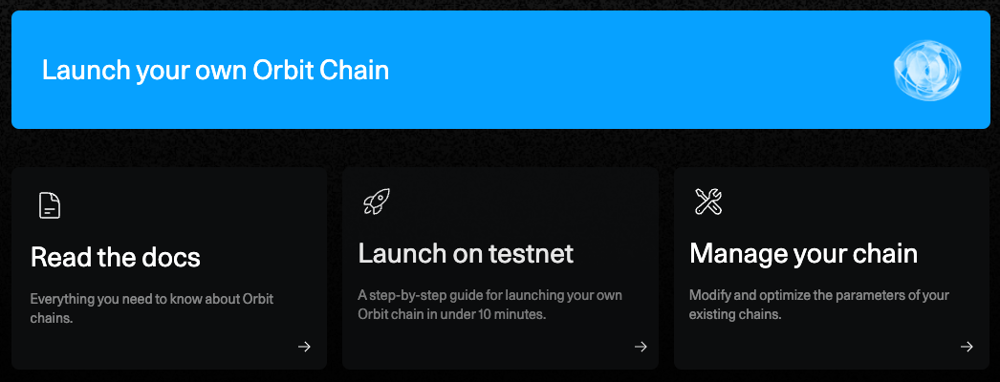

<br/>

설명을 보면, 최소 1.0 Arbitrum Sepolia ETH가 팔요하다고 나온다. 지갑을 연결한 뒤, Next를 클릭한다. <br/>


<br/>

Rollup 방식으로 선택 후, Next 클릭한다. <br/>
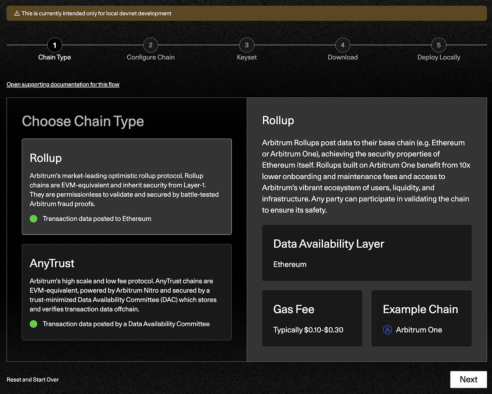

<br/>


기본값으로 놔두고 Deploy를 클릭한다. (값에 대한 설명은 서론에 기입한 아비트럼 Docs 참고) <br/>
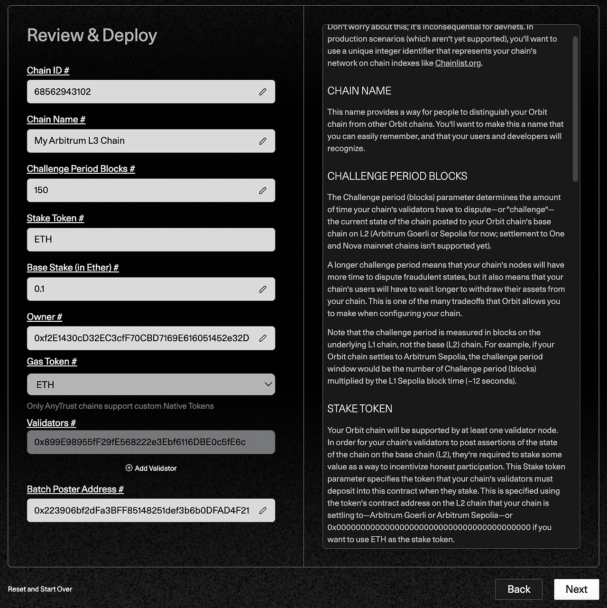

<br/>


가스비 확인 후, 컨펌해준다.

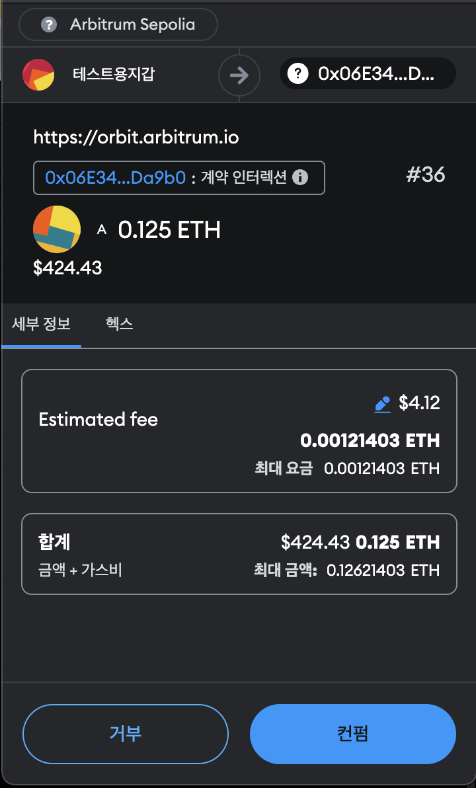


<br/>

컨펌을 하고나면 아래처럼 생성된 체인에 대한 정보가 나온다. Download zip files를 눌러 json이 담긴 zip 파일을 저장하자. 다운로드 받았다면 Next 클릭해주자.
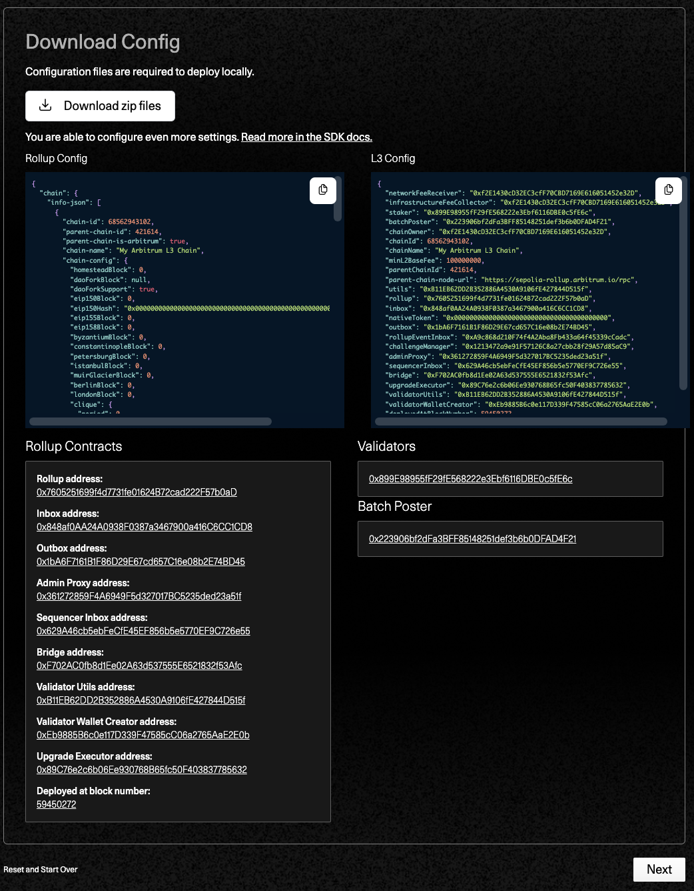

<br/>


이제 로컬에서 배포를 해보도록 한다. <br/>
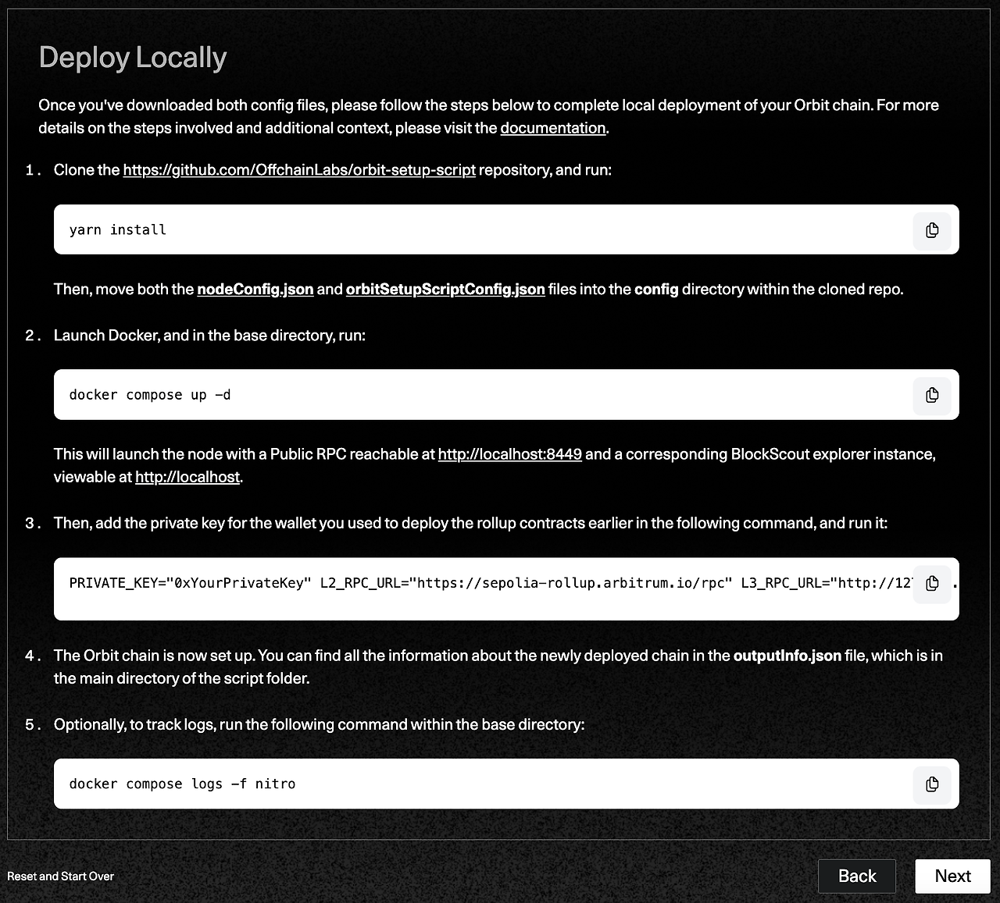

<br/>

위의 설명에따라 차근차근 진행해보도록 하겠다. 아래의 git을 clone 받는다.

```shell
git clone https://github.com/OffchainLabs/orbit-setup-script.git
```

<br/>

clone 후, IDE로 클론받은 프로젝트를 열어주자. 그다음 아래의 명령어로 의존성 설치를 진행해주자.

```shell
yarn install
```

<br/>

그리고 아까 받았던 orbit-config.zip 파일내 nodeConfig.json, orbitSetupScriptConfig.json 파일 2개를 config 디렉터리로 복사해주자. <br/>
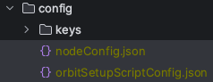

<br/>

docker-compose를 사용해 Docker로 실행해주자. (Docker가 설치되어 있어야 하고 로컬에서 실행중이여야 한다.)
```shell
docker compose up -d
```

<br/>

여러가지 의존성을 설치하며 시간이 좀 걸린다. <br/>
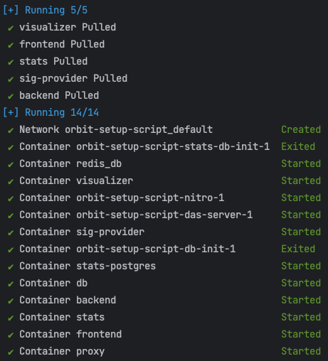

<br/>

Docker가 올라가고 나면 http://localhost:8449 에 RPC와 http://localhost 에 BlockScout 탐색기 인스턴스가 있는 노드가 시작된다. <br/>
 <br/>

<br/>

그럼 이제 다음 명령어로, 롤업 계약을 배포하는 데 사용한 지갑의 개인 키를 추가하고 실행한다. PRIVATE_KEY와 L2_RPC_URL만 변경하면 된다.
```shell
PRIVATE_KEY="0xYourPrivateKey" L2_RPC_URL="https://sepolia-rollup.arbitrum.io/rpc" L3_RPC_URL="http://127.0.0.1:8449" yarn run setup
```

<br/>

아래는 전체적인 과정이 log로 나오게 되고 대략 1 arbitrum sepolia eth가 빠져나가게 된다.
```shell
yarn run v1.22.21
warning package.json: No license field
warning ../../package.json: No license field
$ ts-node scripts/setup.ts
Funding batch-poster accounts on parent chain with 0.3 ETH
Transaction hash on parent chain: 0x405cef02d79dfe712d74479de9678332bb5880380308730048ce03b4ce5621a9
Transaction was mined in block 59453607 on parent chain
Funding staker accounts on parent chain with 0.3 ETH
Transaction hash on parent chain: 0x9b4b1e74e510454fc92037836b99b95aba02f1cc7c8d7a5d796e918e9c8ffffb
Transaction was mined in block 59453625 on parent chain
Running Orbit Chain Native token deposit to Deposit ETH or native ERC20 token from parent chain to your account on Orbit chain ... 💰💰💰💰💰💰
Transaction hash on parent chain:  0xa97304bfd06243d0fd1e5e1df6e8888293a1ccfa1a0e9cd36034de6f15b22c8d
0.4 ETHs are deposited to your account
Balance not changed yet. Waiting for another 30 seconds ⏰⏰⏰⏰⏰⏰ 
Balance of your account on Orbit chain increased by the native token you have just sent.
Running tokenBridgeDeployment or erc20TokenBridge script to deploy token bridge contracts on parent chain and your Orbit chain 🌉🌉🌉🌉🌉
Creating token bridge for rollup 0x7605251699f4d7731fe01624B72cad222F57b0aD
Token bridge deployed in transaction 0x3824423df231cf300e741d11f7b1fc48359b6e2d4342e95dbf25b31f3bbee521
Waiting for retryables...
Retryable #1: 0x04fc8a30350fef31c546dffa682a08537813b69ff3269944aee6b9cd2e6703ca
Retryable #2: 0x7485bb70560c9b6234645231efffde892f17cb8a7711fc32cbb09abe06061035
Done!
Weth gateway set in tx 0xf95742fbcd1e96effbcc136c573c6a815eef41930db83cc6ae4e90a55c9155b9
Waiting for retryables...
Retryable #1: 0xe909a82e82f125053d198a9196a3ede3d417f083c343b1fa0bed707dbc728138
Done!
network.json updated
Done!
Running l3Configuration script to configure your Orbit chain 📝📝📝📝📝
Setting the Minimum Base Fee for the Orbit chain
Minimum Base Fee is set on the block number 13 on the Orbit chain
Setting the  network fee receiver for the Orbit chain
network fee receiver is set on the block number 14 on the Orbit chain
Setting the infrastructure fee collector address for the Orbit chain
infrastructure fee collector address is set on the block number 15 on the Orbit chain
Getting L1 base fee estimate
L1 Base Fee estimate on L2 is 18761101441
Setting L1 base fee estimate on L3 to 18861101441
L1 base fee estimate is set on the block number 16 on the Orbit chain
All things done! Enjoy your Orbit chain. LFG 🚀🚀🚀🚀
Transferring ownership on L3, from rollup owner to upgrade executor 🔃🔃🔃
Adding Upgrade Executor contract to the chain owners
Executor has been added to chain owners on TX: 0x4a554605885cc9915da5f9d10c6bdc2fa1b024e982106d44790ea8c6599c2ba7
Executing removeChainOwner through the UpgradeExecutor contract
Transaction complete, rollup owner removed from chain owners on TX: 0x56f6922a2a4f9e78e09d781583c9422bc964fb39eb3569665e21baed1bac189e
✨  Done in 127.11s.
```

이제 오르빗 체인이 설정이 끝났다. 새로 배포된 체인에 대한 모든 정보는 스크립트 폴더의 루트 디렉터리에 있는 outputInfo.json 파일 에서 확인할 수 있다.

<br/>


또한 아래 명령어를 루트디렉터리에서 실행하면 로그 추적이 가능하다.
```shell
docker compose logs -f nitro
```

<br/>

이제다시 오르빗 사이트에서 Next 버튼을 클릭한다.


<br/>

배포는 완료되었고, 선택적인 단계로 메인넷에 배포하고자하는 경우 아래의 서비스들 이용해야 한다.


<br/>

다시 Manage your chain에 들어온다.
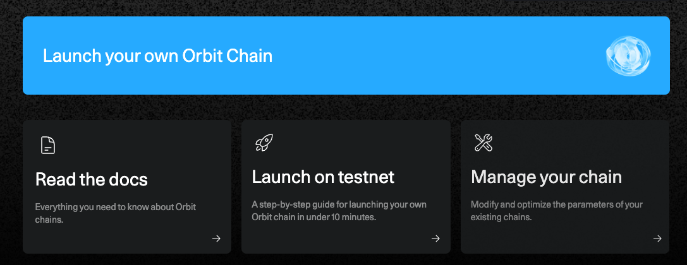

<br/>

outputInfo.json 정보를 참고해 커스텀 체인을 등록할 수 있다. 기입했다면 Add new chain을 클릭하면 된다.

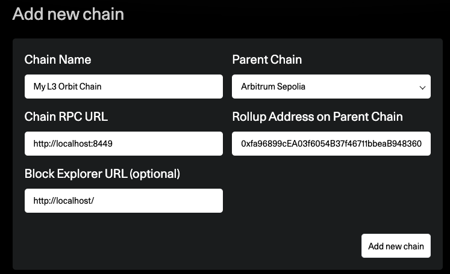

<br/>

그리고 브릿지로 들어와서 Add Custom Orbit Chain을 클릭해보자. outuputinfo.json 파일의 내용을 붙여 넣은 후 Add Chain을 클릭해주자. <br/>
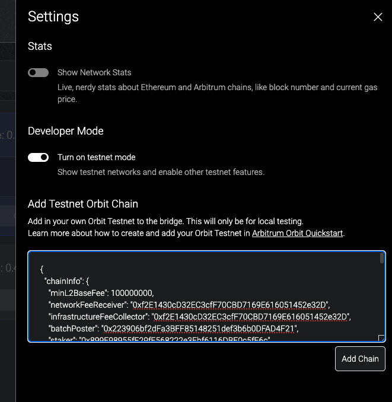

그럼 아래와 같이 등록이 된다. <br/>
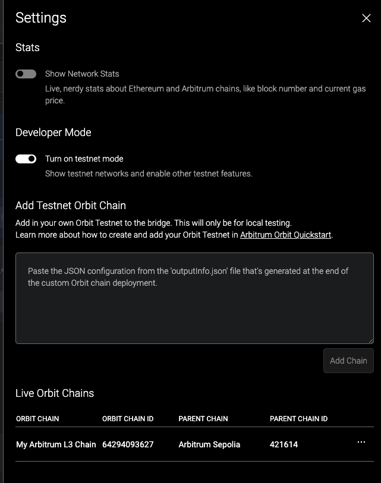

<br/>

만든 체인에 토큰을 다시 L2로 가지고 올 수 있게 된다. <br/>


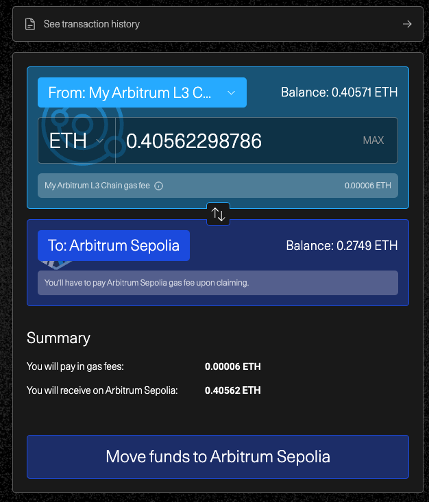


2시간 정도 소요된다고 한다. Continue를 클릭한다.


<br/>

펜딩 상태를 확인한다.


다시 localhost로 들어가보자. <br/>


<br/>


localhost에서 방금 발생한 트랜잭션도 확인할 수 있다.
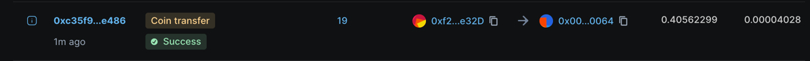


<br/>

지갑 네트워크에도 등록이 되는 것을 확인할 수 있다. <br/>
