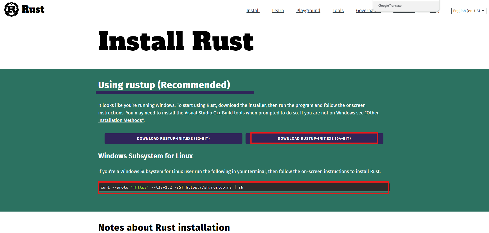

# Arb-Stylus 환경설정

아비트럼 stylus는 Rust와 같은 프로그래밍 언어를 사용하여 arbitrum에서 빌드하려는 개발자를 위한 것 입니다. 자신이 선호하는 프로그래밍언어를 사용하여 EVM호환 스마트계약을 작성하는 것이 Stylus로 가능합니다.

- ### 사용 가능 언어
  - Rust, C, C++ 및 기타 언어로 WASM으로 컴파일되는 프로그래밍언어로 스마트 계약 작성을 가능하게 합니다.
  - WASM 덕분에 Stylus 계약은 훨씬 더 빠르고 가스 요금도 저렴합니다.
  - 블록체인에서 RAM을 소비하는 것이 가능해지면서 Stylus를 사용하면 메모리 비용이 100 ~ 500배 저렴해집니다.

## 0. WSL 설치

맥북 혹은 WSL환경에서 하는 것을 권장합니다. 기본 windows의 shell에서 할 경우 오류가 발생할 수 있습니다. 맥북은 아래의 rust 다운로드 후 사용가능 합니다.

## 1. Rust 설치

- [Rust 설치](https://www.rust-lang.org/tools/install)
  
  rust 설치를 한 후 windows 프로그램 유저는 wsl 환경에서 아래 명령어를 추가로 해 줍니다.
  ```wsl
  curl --proto '=https' --tlsv1.2 -sSf https://sh.rustup.rs | sh
  ```
  rust 가 정상적으로 설치 되었다면 rustc --version으로 정상적으로 깔렸는지 확인합니다.

## 2. 지갑 확인

개발용 지갑에 sepolia eth와 arb sepolia eth를 확인하세요.

## 3. 스타일러스

`cargo-stylus`는 Rust에서 Arbitrum Stylus 프로그램을 관리하는 CLI 도구로, Rust 개발 환경에서 표준 도구인 cargo와 통합되어 사용됩니다.

```rust
cargo install --force cargo-stylus cargo-stylus-check
```

아래 명령어로 rust 컴파일러의 빌드 대상으로 wasm을 추가합니다.

```rust
rustup target add wasm32-unknown-unknown
```

caargo 명령으로 사용할 수 있습니다.

```rust
❯ cargo stylus --help
Cargo subcommand for developing Stylus projects

Usage: cargo stylus <COMMAND>

Commands:
  new         Create a new Rust project // 생성
  export-abi  Export a Solidity ABI     // export abi
  check       Check a contract          // 컨트랙트 체크
  deploy      Deploy a contract         // 배포
  replay      Replay a transaction in gdb   // 트랜잭션 재시작
  trace       Trace a transaction           // 트랜잭션 추적
  c-gen       Generate C code               // c 코드 생성
  help        Print this message or the help of the given subcommand(s)

Options:
  -h, --help     Print help
  -V, --version  Print version
```

### 새 프로젝트 생성

```rust
cargo stylus new <내가만들 프로젝트 명>
```

### 스타일러스 프로젝트 확인

프로그램이 온체인에서 성공적으로 배포되고 활성화 되었는지 하위 명령어를 통해 확인합니다.

```rust
cargo stylus check
```

이 명령은 JSON-RPC 엔드포인트를 지정하여 트랜잭션 없이도 프로그램이 온체인에 배포되고 활성화될 수 있는지 확인하려고 시도합니다

프로그램을 온체인에 배포할 준비가 되면 `cargo stylus deploy` 다음과 같이 하위 명령을 사용할 수 있습니다. 먼저, 다음을 사용하여 배포를 수행하는 데 필요한 가스를 추정할 수 있습니다.

### 가스 추정

```rust
cargo stylus deploy --private-key-path=<사용자의 비밀키 경로> --estimate-gas-only
```

### 배포

```rust
cargo stylus deploy --private-key-path=<사용자의 비밀키 경로>
```

### 체크

아래와 같이 배포가 정상적으로 동작하면 나오게 됩니다.

```rust
Compressed WASM size: 3 KB
Deploying program to address 0x457b1ba688e9854bdbed2f473f7510c476a3da09
Estimated gas: 12756792
Submitting tx...
Confirmed tx 0x42db…7311, gas used 11657164
Activating program at address 0x457b1ba688e9854bdbed2f473f7510c476a3da09
Estimated gas: 14251759
Submitting tx...
Confirmed tx 0x0bdb…3307, gas used 14204908
```
